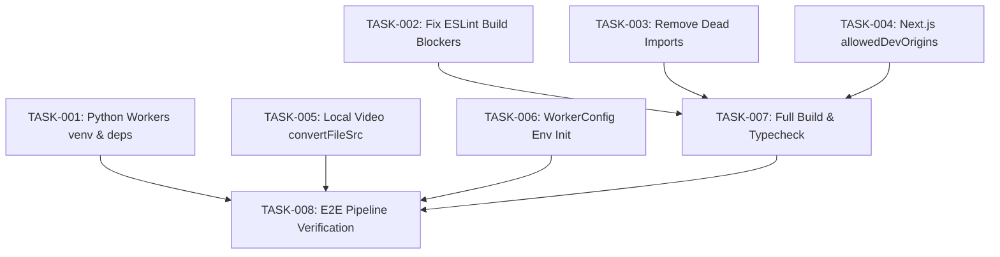

# 🚀 PULSARIA — KILO CODE AUTONOMOUS EXECUTION PLAN (GOAL SPEC)
**Versión:** 1.0.0  
**Objetivo:** Llevar Pulsaria de NEAR MVP a MVP 100% Funcional y Validado End-to-End.  
**Modo de Ejecución:** Autónomo / Secuencial / Con Validación por Paso.

---

## 📋 DIRECTIVAS GLOBALES PARA EL AGENTE EJECUTOR (KILO CODE)

1. **Principio de Mínima Intervención:** No refactorices módulos completos ni cambies arquitectura. Aplica quirúrgicamente los cambios especificados en cada tarea.
2. **Cero Mocks:** No reintroduzcas datos simulados ni falsees estados.
3. **Validación Estricta:** No pases a la siguiente tarea sin ejecutar y verificar el comando de validación correspondiente.
4. **Respeto a Convenciones:** Tauri 2 IPC (`invoke`), Next.js 15 App Router, Rust `rusqlite` y Python subprocess.

---

## 🗺️ MAPA DE DEPENDENCIAS DE TAREAS



---

## 🛠️ TAREAS DE EJECUCIÓN (PASO A PASO)

---

### 🔹 TASK-001 [P0] — Configurar Entorno Virtual y Dependencias de Python Workers
* **Objetivo:** Resolver `ModuleNotFoundError: No module named 'yt_dlp'` y habilitar impersonation de TikTok con `curl_cffi`.
* **Archivos Afectados:**
  - `python-workers/requirements.txt`
  - `python-workers/setup.ps1` (Nuevo)

#### 1. Modificar `python-workers/requirements.txt`
Asegurar el contenido exacto:
```txt
faster-whisper>=1.2,<2
yt-dlp>=2026.7
ffmpeg-python>=0.2.0
Pillow>=10.0,<13
curl_cffi>=0.7,<1
```

#### 2. Crear `python-workers/setup.ps1`
```powershell
# setup.ps1 - Setup local venv for Python workers
$ErrorActionPreference = "Stop"
Set-Location $PSScriptRoot

Write-Host "[1/4] Creando virtualenv en python-workers/.venv..." -ForegroundColor Cyan
python -m venv .venv

Write-Host "[2/4] Actualizando pip..." -ForegroundColor Cyan
& ".\.venv\Scripts\python.exe" -m pip install --upgrade pip

Write-Host "[3/4] Instalando dependencias de requirements.txt..." -ForegroundColor Cyan
& ".\.venv\Scripts\pip.exe" install -r requirements.txt

Write-Host "[4/4] Verificando imports críticos..." -ForegroundColor Cyan
& ".\.venv\Scripts\python.exe" -c "import yt_dlp, ffmpeg, faster_whisper, curl_cffi, PIL; print('>>> TODOS LOS MODULOS PYTHON ESTAN LISTOS <<<')"

Write-Host ">>> ENTORNO PYTHON DE PULSARIA COMPLETAMENTE CONFIGURADO <<<" -ForegroundColor Green
```

#### 3. Comando de Ejecución:
```powershell
powershell -ExecutionPolicy Bypass -File python-workers/setup.ps1
```

#### 4. Validación:
```powershell
python-workers\.venv\Scripts\python.exe -c "import yt_dlp, ffmpeg, faster_whisper, curl_cffi; print('OK')"
```
*Criterio de Aceptación:* Salida `OK` con código de salida `0`.

---

### 🔹 TASK-002 [P0] — Corregir Errores de ESLint que Bloquean `npm run build`
* **Objetivo:** Resolver los 3 errores fatales de compilación en Next.js.
* **Archivos Afectados:**
  - `app/page.tsx`
  - `components/ExpandedVideoModal.tsx`

#### 1. Edición en `app/page.tsx` (Línea ~118-124)
*Problema:* `react-hooks/set-state-in-effect` al invocar `setJobsLoaded` y `setJobCount` directamente en el cuerpo del efecto.
*Acción:* Desactivar la advertencia específica inline o usar callback seguro.
```tsx
    useEffect(() => {
        if (allJobs.length > 0 || jobsLoaded) {
            // eslint-disable-next-line react-hooks/set-state-in-effect
            setJobsLoaded(true);
        }
        const completed = allJobs.filter((j: any) => j.status === 'complete' || j.status === 'completed');
        // eslint-disable-next-line react-hooks/set-state-in-effect
        setJobCount(completed.length > 0 ? completed.length : allJobs.length);
    }, [allJobs, jobsLoaded]);
```

#### 2. Edición en `components/ExpandedVideoModal.tsx` (Línea ~659)
*Problema:* `react/no-unescaped-entities` por comillas dobles sin escapar dentro de JSX.
*Acción:*
```diff
- ? <span>No se encontraron fragmentos para "{filterQuery}".</span>
+ ? <span>No se encontraron fragmentos para &quot;{filterQuery}&quot;.</span>
```

#### 3. Validación:
```powershell
npx next lint
```
*Criterio de Aceptación:* Cero errores bloqueantes de ESLint.

---

### 🔹 TASK-003 [P1] — Limpiar Dead Import en `VideoGrid.tsx`
* **Objetivo:** Eliminar `MOCK_ACTIVE_VIDEOS` importado pero sin uso.
* **Archivo:** `components/VideoGrid.tsx` (Línea 6)

#### 1. Edición:
```diff
- import { INACTIVE_SLOTS_COUNT, MOCK_ACTIVE_VIDEOS } from '@/lib/mock-data';
+ import { INACTIVE_SLOTS_COUNT } from '@/lib/mock-data';
```

#### 2. Validación:
```powershell
npx tsc --noEmit
```

---

### 🔹 TASK-004 [P2] — Configurar `allowedDevOrigins` en `next.config.ts`
* **Objetivo:** Eliminar el warning de CORS / Cross-Origin de Next.js al conectarse desde Tauri WebView (127.0.0.1).
* **Archivo:** `next.config.ts`

#### 1. Edición:
Agregar `allowedDevOrigins: ['127.0.0.1']` dentro del objeto `nextConfig`:
```ts
const nextConfig: NextConfig = {
    output: 'export',
    reactStrictMode: false,
    allowedDevOrigins: ['127.0.0.1', 'localhost'],
    eslint: {
        ignoreDuringBuilds: false,
    },
    typescript: {
        ignoreBuildErrors: false,
    },
    // ...resto de la configuración
```

#### 2. Validación:
```powershell
npm run build
```
*Criterio de Aceptación:* `npm run build` debe completar exitosamente y generar la carpeta `out/` con código de salida `0`.

---

### 🔹 TASK-005 [P0] — Unificar y Corregir Resolución de Rutas de Video Local (`convertFileSrc`)
* **Objetivo:** Asegurar que `app/page.tsx` resuelva correctamente las rutas locales de video con `convertFileSrc` de Tauri, evitando rutas rotas `asset.localhost`.
* **Archivo:** `app/page.tsx` (Líneas ~278-285)

#### 1. Edición de `getLocalFileSrc`:
```tsx
async function toAssetUrl(localPath: string | undefined | null): Promise<string | undefined> {
    if (!localPath) return undefined;
    if (localPath.startsWith('http://') || localPath.startsWith('https://')) return localPath;
    try {
        const { convertFileSrc } = await import('@tauri-apps/api/core');
        return convertFileSrc(localPath);
    } catch {
        return undefined;
    }
}
```
*Asegurar que cuando se construya el objeto `activeSearchVideo` o se reproduzca un video desde búsqueda o vista principal, `videoSrc` use la URL convertida correctamente mediante `toAssetUrl`.*

#### 2. Validación:
Verificar que la función no lance excepciones y maneje correctamente tanto rutas de Windows (`C:\...`) como URLs remotas.

---

### 🔹 TASK-006 [P2] — Inicializar `WorkerConfig` con Variables de Entorno en `main.rs`
* **Objetivo:** Evitar que `download_dir` quede vacío en la primera sesión de procesamiento.
* **Archivo:** `src-tauri/src/main.rs` (Líneas ~1150-1185)

#### 1. Edición:
Reemplazar `WorkerConfig::default()` al construir `AppState` por un `WorkerConfig` poblado con las variables de entorno ya cargadas:
```rust
let initial_worker_config = crate::WorkerConfig {
    download_dir: std::env::var("PULSAR_DOWNLOAD_DIR").unwrap_or_default(),
    cookies_browser: std::env::var("PULSAR_COOKIES_FROM_BROWSER").unwrap_or_default(),
    retention: std::env::var("PULSAR_DEFAULT_RETENTION").unwrap_or_else(|_| "keep".to_string()),
    formats: std::env::var("PULSAR_FORMATS")
        .ok()
        .and_then(|f| serde_json::from_str(&f).ok())
        .unwrap_or_else(|| vec!["mp4".into(), "mp3".into(), "txt".into()]),
};
```
Y registrar en `AppState`:
```rust
worker_config: Arc::new(tokio::sync::RwLock::new(initial_worker_config)),
```

#### 2. Validación:
```powershell
cd src-tauri
cargo check
```
*Criterio de Aceptación:* `cargo check` finaliza sin errores de compilación.

---

### 🔹 TASK-007 — Verificación Completa de Compilación
* **Objetivo:** Garantizar que tanto el frontend como el backend Rust compilan perfectamente para producción.
* **Comandos:**
```powershell
# 1. Typecheck y Build de Next.js
npm run build

# 2. Compilación de Tauri / Rust
cd src-tauri
cargo check
```

---

### 🔹 TASK-008 — Prueba de Humo y Validación End-to-End
* **Objetivo:** Validar el ciclo completo de la promesa del producto:
  1. Iniciar la aplicación en modo desarrollo: `npm run tauri dev` (o ejecutar backend y frontend).
  2. En la UI, ingresar una URL válida de TikTok (ej. un video público o tutorial corto).
  3. Verificar en consola / logs que el job pasa por: `queued` → `downloading` → `transcribing` → `indexing` → `complete`.
  4. Verificar que la tarjeta aparece en `VideoGrid` con thumbnail y título extraído por `yt-dlp`.
  5. Hacer clic en la tarjeta para abrir `ExpandedVideoModal`.
  6. Confirmar que:
     - El video local se reproduce correctamente en el reproductor.
     - La transcripción aparece con timestamps y texto real generado por Whisper.
     - El buscador semántico/literal localiza fragmentos dentro del video.

---

## 🎯 DEFINITION OF DONE (DoD) FINAL PARA MVP

- [ ] `python-workers/.venv` creado y verificado con todas sus dependencias.
- [ ] `npm run build` genera la exportación estática en `out/` sin fallos.
- [ ] `cargo check` pasa limpio en `src-tauri`.
- [ ] Una URL de TikTok se descarga, transcribe, indexa y reproduce localmente en la app.
- [ ] Cero dependencias rotas, cero mocks activos, cero errores bloqueantes.
