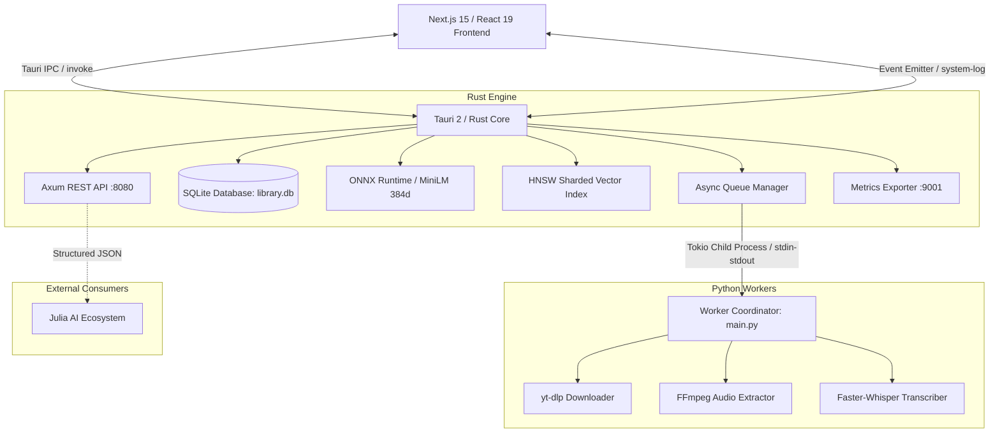

# 🏛️ PULSAR: Arquitectura y Especificaciones Técnicas

> **Documento de especificación técnica de bajo nivel para el motor multimodal Pulsar Eventide.**

---

## 1. Visión General de la Arquitectura

Pulsar está diseñado como un motor desacoplado de alto rendimiento donde el backend nativo (Rust/Tauri) gestiona la orquestación, persistencia, inferencia de embeddings y búsqueda vectorial, mientras que los workers especializados (Python) procesan la descarga y transcripción pesada de medios, y la interfaz (Next.js 15 / React 19) ofrece una experiencia reactiva y fluida.



---

## 2. Esquema de Base de Datos (SQLite)

La persistencia local reside en `data/library.db` y se gestiona mediante `rusqlite` en modo WAL (*Write-Ahead Logging*).

### 2.1 Tabla `jobs`
Gestiona el ciclo de vida de las tareas de procesamiento.

```sql
CREATE TABLE IF NOT EXISTS jobs (
    id INTEGER PRIMARY KEY AUTOINCREMENT,
    url TEXT NOT NULL,
    status TEXT NOT NULL DEFAULT 'queued', -- 'queued', 'downloading', 'transcribing', 'indexing', 'completed', 'error'
    progress INTEGER NOT NULL DEFAULT 0,    -- 0 a 100
    created_at DATETIME DEFAULT CURRENT_TIMESTAMP
);
```

### 2.2 Tabla `media`
Almacena metadatos y referencias a los archivos descargados y procesados.

```sql
CREATE TABLE IF NOT EXISTS media (
    id INTEGER PRIMARY KEY AUTOINCREMENT,
    job_id INTEGER NOT NULL UNIQUE,
    video_path TEXT,
    audio_path TEXT,
    transcript_path TEXT,
    title TEXT,
    author TEXT,
    thumbnail TEXT,
    duration INTEGER,
    upload_date TEXT,
    FOREIGN KEY(job_id) REFERENCES jobs(id)
);
```

### 2.3 Tabla `transcript_embeddings`
Almacena los fragmentos (*chunks*) de texto transcrito junto con sus vectores densos.

```sql
CREATE TABLE IF NOT EXISTS transcript_embeddings (
    id INTEGER PRIMARY KEY AUTOINCREMENT,
    job_id INTEGER NOT NULL,
    chunk_index INTEGER NOT NULL,
    chunk_text TEXT NOT NULL,
    embedding_vector BLOB NOT NULL, -- 384 floats (f32) codificados en Little-Endian (1536 bytes)
    FOREIGN KEY(job_id) REFERENCES jobs(id)
);
```

---

## 3. Especificación del Motor Vectorial

### 3.1 Modelo de Embeddings
- **Modelo:** `all-MiniLM-L6-v2` exportado a formato ONNX.
- **Dimensiones:** `384` floats.
- **Ruta del artefacto:** `src-tauri/assets/models/all-minilm-l6-v2.onnx`
- **Normalización:** Los vectores se normalizan mediante norma L2 antes de la indexación y consulta para permitir similitud Coseno mediante producto punto rápido.

### 3.2 Estrategia de Chunking
- **Tamaño de chunk predeterminado:** 150 caracteres (con ventana deslizante semántica de 50 caracteres de solapamiento).
- **Asociación temporal:** Cada chunk mantiene trazabilidad hacia el segundo de inicio y fin en el audio original para permitir saltos directos en el reproductor.

### 3.3 Indexación HNSW (Hierarchical Navigable Small World)
- **Shards:** 4 shards paralelos para optimizar concurrencia en lectura.
- **Persistencia:** Snapshots periódicos almacenados en `data/vector_index_shard_*.hnsw`.

---

## 4. Pipeline de Procesamiento de Workers (Python)

Los workers se ejecutan como subprocesos aislados invocados por el `QueueManager` de Rust para evitar que el renderizado o el motor principal se vean afectados por fallos de dependencias pesadas:

1. **`downloader.py`:**
   - Invocación con `yt-dlp`.
   - Extrae video en calidad óptima (`.mp4`), miniatura (`.jpg`), título, autor, duración y estadísticas.
   - Informa progreso vía `stdout` (JSON estructurado).
2. **`audio_extractor.py`:**
   - Utiliza `ffmpeg` para extraer la pista de audio a WAV 16kHz mono (formato óptimo para Whisper).
3. **`transcriber.py`:**
   - Carga el modelo `faster-whisper` (modo CPU int8 o CUDA si está disponible).
   - Genera transcripción completa con marcas de tiempo por segmento (`start`, `end`, `text`).
4. **Retorno a Rust:**
   - El worker emite el resultado final en JSON.
   - El core de Rust calcula los embeddings ONNX, guarda los chunks en SQLite y actualiza los índices HNSW.

---

## 5. Comandos e Interfaces Tauri IPC

| Comando Tauri (`invoke`) | Argumentos | Retorno | Propósito |
|---|---|---|---|
| `add_job` | `{ url: string }` | `Result<number, string>` | Encola un nuevo video para descarga y procesamiento. |
| `get_jobs` | Ninguno | `Result<JobRecord[], string>` | Obtiene la lista completa de videos y su estado. |
| `search_transcripts` | `{ query: string, limit?: number, min_score?: number }` | `Result<SearchResult[], string>` | Ejecuta búsqueda semántica vectorial. |
| `get_model_status` | Ninguno | `Result<ModelStatus, string>` | Informa estado de carga, dimensiones y memoria del modelo ONNX. |
| `get_db_status` | Ninguno | `Result<DbStatus, string>` | Informa salud de la base de datos, conteo de videos y chunks. |
| `get_search_config` | Ninguno | `Result<SearchConfig, string>` | Obtiene los umbrales de búsqueda configurados. |
| `get_system_metrics` | Ninguno | `Result<SystemMetrics, string>` | Métricas de latencia de consulta, inferencia y DB. |
| `debug_search_transcripts` | `{ query: string, limit?: number, min_score?: number }` | `Result<DebugSearchResult, string>` | Búsqueda con desglose milimétrico de latencias. |

---

## 6. Contrato de Integración con el Ecosistema Julia

Pulsar exporta fichas de conocimiento estructurado a través de endpoints REST (`:8080/api/v1/export/:job_id`) o mediante archivos JSON generados cuando `julia_ready == true`:

```json
{
  "source": "pulsar-eventide",
  "version": "1.0",
  "video_id": 1042,
  "url": "https://www.tiktok.com/@user/video/123456789",
  "platform": "tiktok",
  "metadata": {
    "title": "Tutorial de optimización Rust y Tokio",
    "author": "dev_expert",
    "duration_seconds": 45,
    "upload_date": "2026-08-15"
  },
  "content": {
    "summary": "Explicación concisa de cómo evitar bloqueos en el thread pool de Tokio usando spawn_blocking.",
    "topics": ["Rust", "Concurrencia", "Tokio", "Performance"],
    "intent": "Educativo / Programación",
    "transcript": "Hoy te voy a enseñar cómo optimizar tus tareas en Rust...",
    "segments": [
      {
        "start": 0.0,
        "end": 4.2,
        "text": "Hoy te voy a enseñar cómo optimizar tus tareas en Rust"
      }
    ],
    "visual_text": [],
    "visual_observations": []
  },
  "embeddings_metadata": {
    "model": "all-MiniLM-L6-v2",
    "dimension": 384,
    "total_chunks": 4
  },
  "julia_ready": true
}
```
