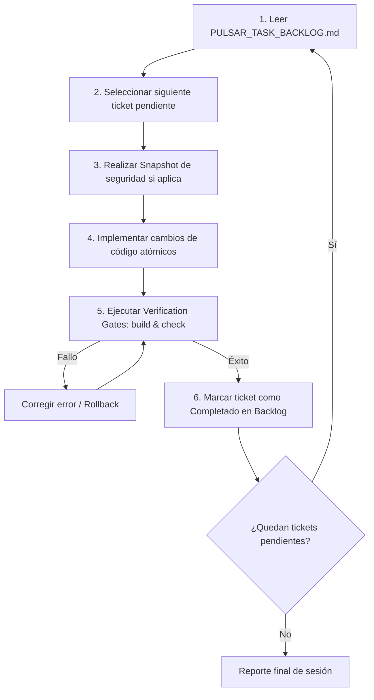

# 🔄 PULSAR: Protocolo de Ejecución Autónoma en Bucle (Loop Guide)

> **Manual de instrucciones y protocolo para sesiones de desarrollo autónomo nocturno o de larga duración utilizando el comando `/goal` de Antigravity.**

---

## 🎯 Objetivo

Este protocolo establece el flujo de trabajo automatizado, seguro y determinista para permitir que el agente de IA programe de forma continua durante horas sin intervención humana, avanzando a través del [Backlog de Tareas](file:///docs/PULSAR_TASK_BACKLOG.md) sin romper la estabilidad del backend de Rust ni del frontend de Next.js.

---

## 🛡️ Reglas de Seguridad del Bucle Autónomo

Para garantizar que la ejecución nocturna sea 100% segura y no sufra regresiones catastróficas, el agente **debe cumplir estrictamente** las siguientes 5 reglas:

### Regla 1: Snapshots Automáticos Antes de Modificaciones
Antes de ejecutar cualquier cambio en la base de datos `data/library.db` o en esquemas SQL:
- Crear una copia de seguridad en `_runtime_backups/snapshot_TIMESTAMP.db`.

### Regla 2: Puertas de Verificación Obligatorias (*Verification Gates*)
Tras implementar cada ticket del backlog:
1. **Frontend:** Ejecutar `npm run build` (o comprobar sintaxis con `npx tsc --noEmit`).
2. **Backend:** Ejecutar `cargo check` dentro de `src-tauri/`.
3. Si alguna verificación falla, el agente **debe corregir el error inmediatamente** antes de pasar al siguiente ticket.

### Regla 3: Preservación de Fallbacks e Integridad Visual
No eliminar `lib/mock-data.ts` ni slots inactivos hasta que la base de datos contenga datos reales persistidos y confirmados, evitando que el grid colapse visualmente.

### Regla 4: Avance Atómico
- Resolver exactamente **un ticket a la vez** (ej. `TASK-6B-01`, luego `TASK-6B-02`, etc.).
- Actualizar el estado del ticket en `docs/PULSAR_TASK_BACKLOG.md` a `✅ Completado` tras verificar su funcionamiento.

### Regla 5: Sin Elevación Irregular de Privilegios
Cumplir siempre con la regla global de seguridad del sistema (UAC estándar únicamente en caso de ser necesario).

---

## 🔁 Algoritmo del Bucle de Programación Autónoma

Cada iteración del bucle sigue este ciclo inmutable:



---

## 📋 Prompt Maestro para Iniciar la Sesión Autónoma (/goal)

Para dejar al agente programando toda la noche, utiliza el siguiente comando con el slash command `/goal`:

```markdown
/goal Ejecuta el ciclo de desarrollo continuo y autónomo para Pulsar siguiendo estrictamente docs/PULSAR_AUTONOMOUS_EXECUTION_LOOP.md y docs/PULSAR_TASK_BACKLOG.md.

Instrucciones para la sesión:
1. Lee docs/PULSAR_TASK_BACKLOG.md y toma el primer ticket con estado pendiente.
2. Implementa la solución de forma atómica y limpia.
3. Ejecuta las verificaciones de compilación (npm run build y cargo check).
4. Actualiza el backlog marcando el ticket completado.
5. Continúa de forma iterativa con el siguiente ticket sin detenerte hasta completar la fase en curso.
6. Si encuentras un bloqueo insuperable en una tarea específica, aísla el problema, registra la incidencia en el backlog y continúa con las tareas independientes.
```
